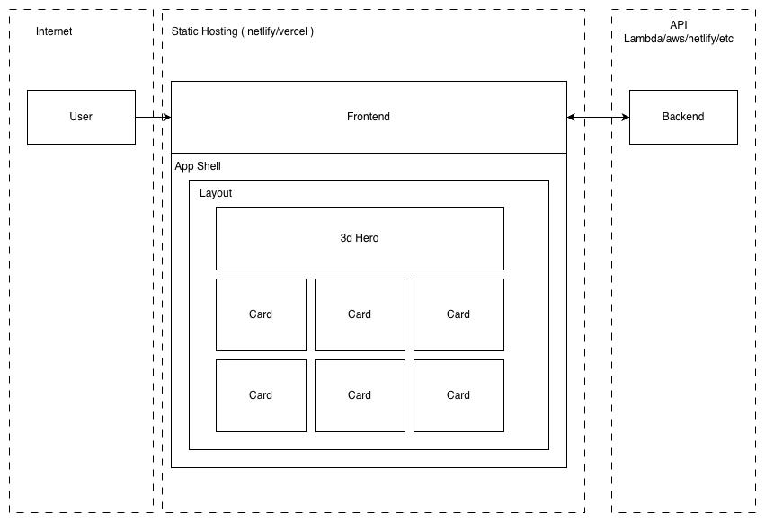

# Burger Frontend 1.0

This is a proof of concept of a burger frontend.

## Requirements

nodejs stable 24.14.1 ( nvm use stable )

## Installation

`npm install`

## Running the repo

`npm run dev`

## Linting

`npm run lint`

## Backend example

A simple backend can be created for the burgers api:

```js
import { Hono } from 'hono'
import burgers from './data/burgers.json'
import topBurgers from './data/top-burgers.json'

const app = new Hono()

// GET /burgers
app.get('/burgers', (c) => {
return c.json(burgers)
})

// GET /top-burgers
app.get('/top-burgers', (c) => {
return c.json(topBurgers)
})

// GET /burgers/:id
app.get('/burgers/:id', (c) => {
const id = c.req.param('id')
const burger = (burgers as any[]).find(b => b.id === id)

if (!burger) {
return c.json({ error: 'Burger not found' }, 404)
}

return c.json(burger)
})

export default app
```

## Architecture & libraries



This repo uses the following libraries:

```
react
tailwindcss
shadcn
lucide-react
react-router-dom
tanstack-query
axios
zod
three
react-three/fiber
react-three/drei
react-three/postprocessing
```
